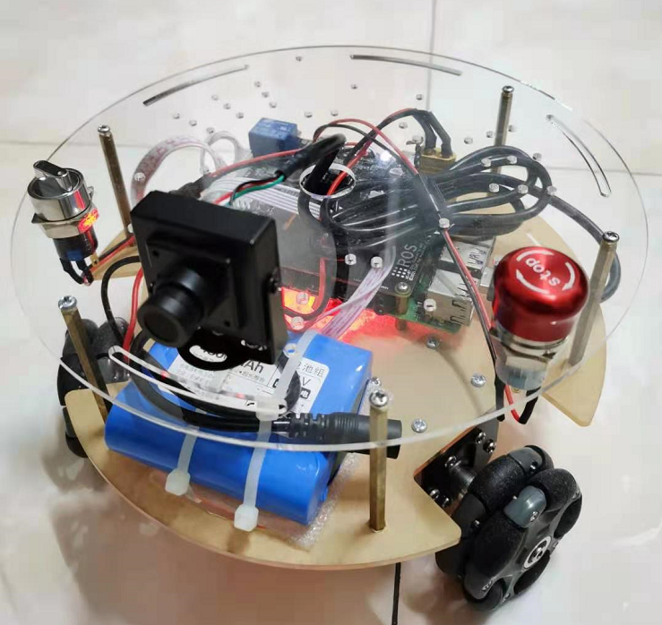
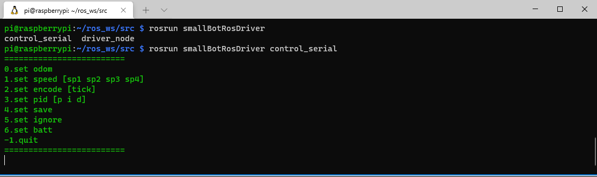

# smallBotRosDriver
这是一个用来运行在ros noetic的ros驱动库，主要服务于[smallBot](https://tea.lan.bigkeer.cn/SLAM2020/Project-SmallBot)。



## 项目介绍

1. 这是一个单纯的从兴趣出发的项目。
2. 整车的运算单元为一块MCU和树莓派4B
   * MCU部分主要实现底层功能，例如电平控制等，实现协议。
   * 树莓派4B承担了主要的复杂运算，以及为了之后的功能拓展留下算力空间(例如万一想在上面跑SLAM呢)
3. 本仓库仅仅为该项目上位机驱动部分。
4. 设计的目标，是用尽可能低的成本设计出一台各方面功能都还凑合的玩具，目前已经实现的功能如下：
   * 可通过ros控制底盘，默认情况下订阅的是`cmd_vel`话题
   * 实现了一个里程计，可通过话题或者tf获取。
   * 实现了电量监控。

## 主要功能

### driver_node
* 接收[geometry_msgs/Twist](http://docs.ros.org/en/melodic/api/geometry_msgs/html/msg/Twist.html),并且根据[协议](https://tea.lan.bigkeer.cn/SLAM2020/Project-SmallBot-MCU)转化数据，并且通过串口发送到下位机。
* 根据[协议](https://tea.lan.bigkeer.cn/SLAM2020/Project-SmallBot-MCU)从下位机读取数据，然后转化到TF数据和[nav_msgs/Odometry](http://docs.ros.org/en/kinetic/api/nav_msgs/html/msg/Odometry.html)话题。
### serial_control
* 类似串口调试助手？实现[协议](https://tea.lan.bigkeer.cn/SLAM2020/Project-SmallBot-MCU)的所有功能，主要用来调试小车用的

  
## 安装
1. 各种ros库
> 缺啥`apt install`一下啥
2. Eigen3
> 主要用于数学相关的计算

> ` sudo apt install libeigen3-dev `
3. boost
> 主要是串口要用到
4. g++
> 要支持c++17及以上

## 安装方式
```
git clone xxx
cd ws
catkin_make
```
## 运行方式
```bash
rosrun smallBotRosDriver control_serial port baud_rate #启动控制台版的串口调试助手
roslaunch smallBotRosDriver driver.launch #启动ros节点
```

## 功能介绍
* [timerAndColor](src/timerAndColor)
> 主要用于颜色输出和时间获取
* [driver_base](src/driver_base.h)
> 主要用于解析ros 的 cmd指令，并发送到下位机
* [driver_odom](src/driver_odom.h)
> 主要用于接收下位机odom数据，并解析到ros话题和tf上。
* [serial_protocol](src/serial_protocol.h)
> 根据和下位机的通讯[协议](https://tea.lan.bigkeer.cn/SLAM2020/Project-SmallBot-MCU)所定义的一个底层工具，本项目中的所有功能都依附于这个

## 参数介绍
### [driver_node](launch/driver.launch)
| 参数 |  类型   | 说明 |
|---|  ----  | ----  |
| port| str  |串口名字|
| baud_rate| int  | 波特率 |
| cmd| str  | 速度的话题名字 |
| timeout_millseconds| int  | 超时重发的最长等待时间，单位 毫秒 |
| send_queue_size| int  | 发送队列的长度 |
| reductionRate| double  | 减速度比 例如 1:30=1/30=0.3333 |
| L| double  | 车子半径 |
| wheelR| double  | 轮子半径 |
| tpr| double  | 多少个tick一周 |
| odom_name| str  | odom的话题名 |
| odom_rate| double  | odom的采样频率 hz|
| odom_frame| str  | odom的frame名 |
| child_frame| str  | odom的child frame 名 |
| sendTF| bool  | 是否发TF |
| sendOdom| bool  | 是否发话题 |
| batt_rate| double  | 电池电量更新频率 |
| batt_raw_name| str  | 电池电压的话题 |
| batt_percent_name| str  | 电池电量百分比的话题 |
| batt_table_path| str  | 电池电量查询表 |


